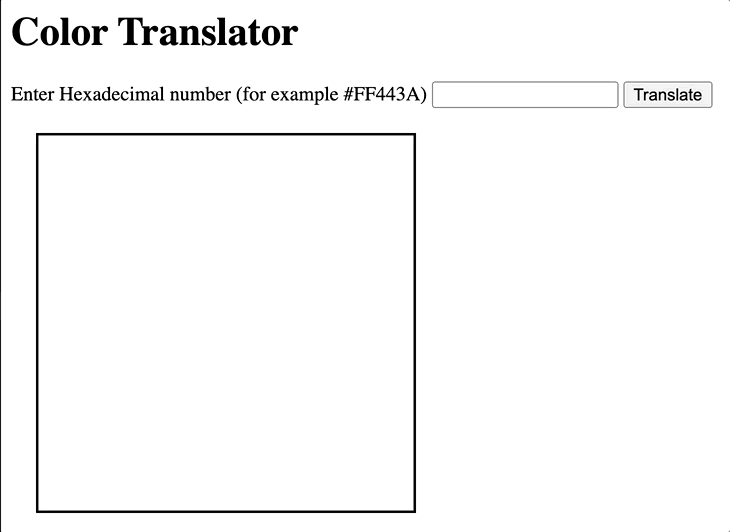

# Color Translator

A web development tool that translates a hexadecimal number to its corresponding RGB color.

## Motivation

I was learning web development and wanted to build a simple tool to immedately translate a hexadecmial number to the color, so that I could the appropriate color to use for my design.

